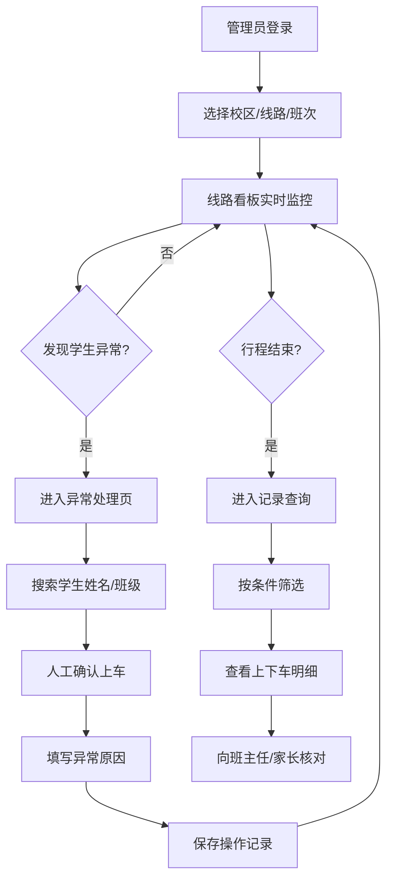

# 校车安全核验工作台 PRD

## 1. 产品概述

面向校车安全管理员的Web核验工作台，聚焦于每天早晚两趟的刷卡上下车闭环管理，通过可视化看板、异常处理和记录查询三大模块，确保学生乘车安全可追溯，为管理员提供清晰、高效的核验操作平台。

## 2. 核心功能

### 2.1 用户角色

| 角色 | 登录方式 | 核心权限 |
|------|----------|----------|
| 安全管理员 | 账号密码 | 查看线路看板、处理异常、查询记录、导出数据 |
| 司机/照管员 | 账号密码 | 查看线路看板、人工确认上车异常处理 |

### 2.2 功能模块

1. **线路看板页**：校区/线路/班次筛选器、站点统计看板、风险颜色提示、实时进度条
2. **异常处理页**：学生搜索（姓名/班级）、人工确认上车、异常原因登记、操作记录列表
3. **记录查询页**：日期范围筛选、车牌筛选、学生姓名搜索、上下车明细表格、站点信息展示

### 2.3 页面详情

| 页面名称 | 模块名称 | 功能描述 |
|-----------|-----------|---------------------|
| 线路看板 | 顶部筛选器 | 选择校区、线路、班次（早班/晚班），支持日期选择 |
| 线路看板 | 概览卡片 | 总学生数、已上车数、未刷卡数、已下车数、异常数五大指标 |
| 线路看板 | 站点列表 | 按站点顺序展示每个站点的应上车、已刷上车、未刷卡、已下车人数，颜色区分风险等级 |
| 线路看板 | 风险颜色 | 绿色（正常）、黄色（关注）、橙色（警告）、红色（严重） |
| 线路看板 | 进度条 | 整体乘车完成度、各站点完成进度可视化 |
| 异常处理 | 搜索框 | 输入学生姓名或班级关键词进行模糊搜索 |
| 异常处理 | 学生列表 | 展示匹配学生的基本信息（姓名、班级、学号、所属站点） |
| 异常处理 | 异常登记 | 选择"人工确认上车"操作，填写异常原因（下拉+备注） |
| 异常处理 | 今日异常 | 展示当天所有人工确认记录，包含操作人、操作时间、学生信息、原因 |
| 记录查询 | 多条件筛选 | 日期范围、车牌号、学生姓名、线路组合筛选 |
| 记录查询 | 明细表 | 学生姓名、班级、车牌号、上车时间、上车站点、下车时间、下车站点、状态标签 |
| 记录查询 | 统计汇总 | 查询结果的乘车人次、异常次数等统计信息 |
| 记录查询 | 导出功能 | 支持将查询结果导出为Excel |

## 3. 核心流程

### 3.1 早班乘车核验流程

管理员登录系统 → 选择校区、线路、早班 → 看板显示各站点学生情况 → 司机/照管员发现学生忘带卡 → 进入异常处理页 → 搜索学生姓名 → 人工确认上车并填写原因 → 看板实时更新数据 → 全程实时查看各站点上下车状态

### 3.2 晚班乘车核验流程

管理员登录系统 → 选择晚班班次 → 看板监控学生上车情况 → 异常处理登记 → 行程结束后核对数据一致性

### 3.3 事后查证流程

管理员进入记录查询 → 选择日期范围、输入学生姓名或车牌 → 查看上下车明细 → 向班主任/家长反馈乘车情况

## 4. 用户界面设计

### 4.1 设计风格

**视觉定位：专业安全管控风格**

- **主色调**：深邃藏青色 `#1E3A5F`（安全、专业、可信赖）
- **辅色调**：
  - 安全绿 `#10B981`（正常状态）
  - 警示黄 `#F59E0B`（关注状态）
  - 警告橙 `#F97316`（警告状态）
  - 危险红 `#EF4444`（严重异常）
- **信息蓝** `#3B82F6`（辅助信息、链接）
- **中性色**：白色 `#FFFFFF`、浅灰 `#F1F5F9`、深灰 `#334155`

**设计元素：**
- 卡片式布局，圆角 `8px`，柔和阴影
- 顶部导航采用深色背景 + 白色文字
- 数据数字采用等宽字体，突出数字可读性
- 风险状态色块配合图标，一眼可辨识
- 按钮风格：实心圆角按钮，悬停有轻微上浮效果

**字体选择：**
- 标题字体：思源黑体（Noto Sans SC）Bold
- 正文字体：思源黑体（Noto Sans SC）Regular
- 数据字体：JetBrains Mono（等宽数字展示）

### 4.2 页面设计概览

| 页面名称 | 模块名称 | UI元素 |
|-----------|-----------|----------|
| 线路看板 | 顶部筛选器 | 下拉选择框、日期选择器、刷新按钮、深色背景横条 |
| 线路看板 | 概览卡片组 | 5个带图标的数据卡片，横向排列，数字放大展示 |
| 线路看板 | 站点列表 | 纵向排列的站点卡片，每张卡片包含4个数据指标，左侧站点编号，右侧状态色块 |
| 线路看板 | 进度条 | 顶部总进度条（渐变蓝绿），每个站点内小进度条 |
| 异常处理 | 搜索区 | 大搜索框带放大镜图标，下方搜索标签（今日热门搜索） |
| 异常处理 | 学生结果卡 | 卡片式学生列表，头像+基本信息+操作按钮 |
| 异常处理 | 异常表单弹窗 | 居中弹窗，学生信息预览、异常原因下拉、备注输入框、确认/取消按钮 |
| 异常处理 | 今日异常列表 | 表格形式，斑马纹背景，状态标签彩色显示 |
| 记录查询 | 筛选栏 | 多条件横排筛选器，查询按钮+重置按钮+导出按钮 |
| 记录查询 | 统计卡片 | 查询结果的统计摘要（人次、异常数、准点率） |
| 记录查询 | 明细表 | 大表格，固定表头可滚动，状态标签彩色，支持点击行展开详情 |

### 4.3 响应式设计

- **桌面优先**：主要面向PC端管理员使用，主内容区宽度 `1280px`
- **平板适配**：在 `768px-1024px` 宽度下，筛选器换行为两行，概览卡片换行为 2-3列
- **移动适配**：在 `<768px` 宽度下，纵向单列布局，表格支持横向滚动

### 4.4 动效设计

- 页面加载：卡片从下往上渐入，`0.4s` 错开动画
- 数字变化：数字滚动动画（Counter Up效果）
- 状态变化：风险颜色变化时有 `0.3s` 渐变过渡
- 按钮交互：悬停时轻微上浮 + 阴影加深
- 弹窗出现：背景模糊 + 弹窗缩放出现
