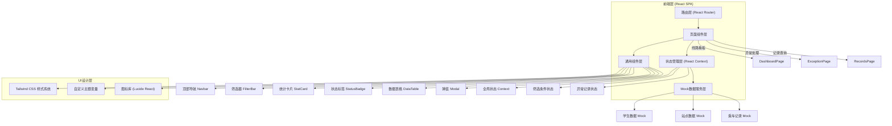
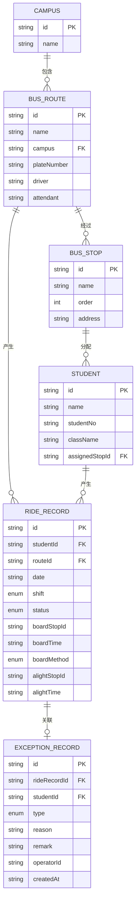

# 校车安全核验工作台 技术架构文档

## 1. 架构设计



## 2. 技术说明

- **前端框架**：React@18 + TypeScript@5
- **构建工具**：Vite@5
- **样式方案**：Tailwind CSS@3（原子化CSS）+ 自定义CSS变量主题
- **路由管理**：React Router DOM@6
- **状态管理**：React Context + useReducer（轻量级全局状态）
- **图标库**：Lucide React（现代化SVG图标）
- **日期处理**：date-fns（轻量日期工具库）
- **数据表格**：自定义组件（无需额外依赖）
- **后端**：无，纯前端 Mock 数据驱动演示
- **数据持久化**：LocalStorage（存储异常处理记录）

## 3. 路由定义

| 路由路径 | 页面名称 | 说明 |
|---------|----------|------|
| `/` | 线路看板页 | 默认首页，展示实时乘车核验看板 |
| `/dashboard` | 线路看板页 | 同上，与 `/` 等价 |
| `/exceptions` | 异常处理页 | 人工确认上车、异常登记处理 |
| `/records` | 记录查询页 | 历史上下车记录查询与导出 |

## 4. 类型定义（TypeScript）

```typescript
// 基础实体类型
interface Student {
  id: string;
  name: string;
  studentNo: string;
  className: string;
  avatar?: string;
  assignedStopId: string;
}

interface BusStop {
  id: string;
  name: string;
  order: number;
  address: string;
  assignedStudents: string[];
}

interface BusRoute {
  id: string;
  name: string;
  campus: string;
  plateNumber: string;
  stops: string[];
  driver: string;
  attendant: string;
}

interface Campus {
  id: string;
  name: string;
  routes: string[];
}

// 乘车记录类型
type RideStatus = 'pending' | 'boarded' | 'alighted' | 'manual_boarded' | 'missing';
type ShiftType = 'morning' | 'evening';

interface RideRecord {
  id: string;
  studentId: string;
  routeId: string;
  date: string;
  shift: ShiftType;
  boardStopId?: string;
  boardTime?: string;
  boardMethod: 'card' | 'manual';
  alightStopId?: string;
  alightTime?: string;
  alightMethod: 'card' | 'manual' | null;
  status: RideStatus;
}

// 异常记录类型
interface ExceptionRecord {
  id: string;
  date: string;
  shift: ShiftType;
  studentId: string;
  routeId: string;
  type: 'manual_board' | 'missing_card';
  reason: string;
  remark?: string;
  operatorId: string;
  operatorName: string;
  createdAt: string;
}

// 站点统计类型
interface StopStats {
  stopId: string;
  totalExpected: number;
  boarded: number;
  notBoarded: number;
  alighted: number;
  manualBoarded: number;
  riskLevel: 'normal' | 'attention' | 'warning' | 'critical';
}

// 看板总览类型
interface DashboardOverview {
  totalStudents: number;
  totalBoarded: number;
  totalNotBoarded: number;
  totalAlighted: number;
  totalExceptions: number;
  completionRate: number;
}

// 筛选条件类型
interface FilterConditions {
  campusId: string;
  routeId: string;
  shift: ShiftType;
  date: string;
}

interface RecordFilters {
  startDate: string;
  endDate: string;
  plateNumber: string;
  studentName: string;
  routeId: string;
}
```

## 5. 数据模型

### 5.1 实体关系图



### 5.2 Mock 数据说明

**预置数据范围：**
- 校区：2个（东校区、西校区）
- 线路：每个校区2条线路，共4条线路
- 站点：每条线路5-7个站点
- 学生：每条线路30-50名学生
- 乘车记录：近7天的早班和晚班记录
- 异常记录：每日3-8条异常

## 6. 目录结构

```
src/
├── assets/              # 静态资源
│   └── styles/          # 全局样式
│       └── index.css    # Tailwind入口 + 自定义主题
├── components/          # 通用组件
│   ├── layout/          # 布局组件
│   │   ├── Navbar.tsx   # 顶部导航栏
│   │   └── Layout.tsx   # 整体布局容器
│   ├── common/          # 通用UI组件
│   │   ├── StatCard.tsx
│   │   ├── StatusBadge.tsx
│   │   ├── Modal.tsx
│   │   ├── Button.tsx
│   │   ├── Select.tsx
│   │   ├── Input.tsx
│   │   └── DatePicker.tsx
│   └── features/        # 业务组件
│       ├── dashboard/
│       │   ├── FilterBar.tsx
│       │   ├── OverviewCards.tsx
│       │   ├── StopList.tsx
│       │   └── StopCard.tsx
│       ├── exceptions/
│       │   ├── StudentSearch.tsx
│       │   ├── StudentCard.tsx
│       │   ├── ExceptionForm.tsx
│       │   └── ExceptionList.tsx
│       └── records/
│           ├── RecordsFilter.tsx
│           ├── RecordsSummary.tsx
│           └── RecordsTable.tsx
├── context/             # React Context
│   └── AppContext.tsx   # 全局状态管理
├── data/                # Mock数据
│   ├── campuses.ts
│   ├── routes.ts
│   ├── stops.ts
│   ├── students.ts
│   ├── rideRecords.ts
│   └── exceptions.ts
├── pages/               # 页面组件
│   ├── DashboardPage.tsx
│   ├── ExceptionsPage.tsx
│   └── RecordsPage.tsx
├── types/               # TypeScript类型定义
│   └── index.ts
├── utils/               # 工具函数
│   ├── date.ts          # 日期处理
│   ├── stats.ts         # 统计计算
│   └── colors.ts        # 颜色/风险等级
├── hooks/               # 自定义Hooks
│   └── useLocalStorage.ts
├── App.tsx              # 根组件
├── main.tsx             # 入口文件
└── router.tsx           # 路由配置
```

## 7. 关键技术决策

### 7.1 风险等级计算规则

```typescript
// 未刷卡比例计算
const missingRatio = notBoarded / totalExpected;

if (missingRatio === 0) return 'normal';      // 绿色 - 全员已刷卡
if (missingRatio <= 0.05) return 'attention'; // 黄色 - 5%以内
if (missingRatio <= 0.15) return 'warning';   // 橙色 - 15%以内
if (missingRatio > 0.15) return 'critical';   // 红色 - 超过15%
```

### 7.2 状态持久化

异常处理记录使用 LocalStorage 持久化存储，Key 格式：`bus-exception-{date}`，确保刷新页面后数据不丢失。

### 7.3 看板数据刷新策略

- 页面加载时初始化数据
- 异常处理操作后即时更新看板统计
- 提供手动刷新按钮
- 每30秒自动刷新一次（可选）
